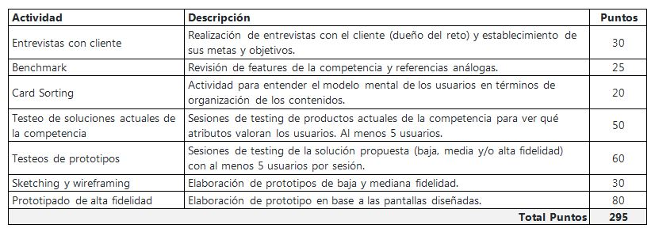
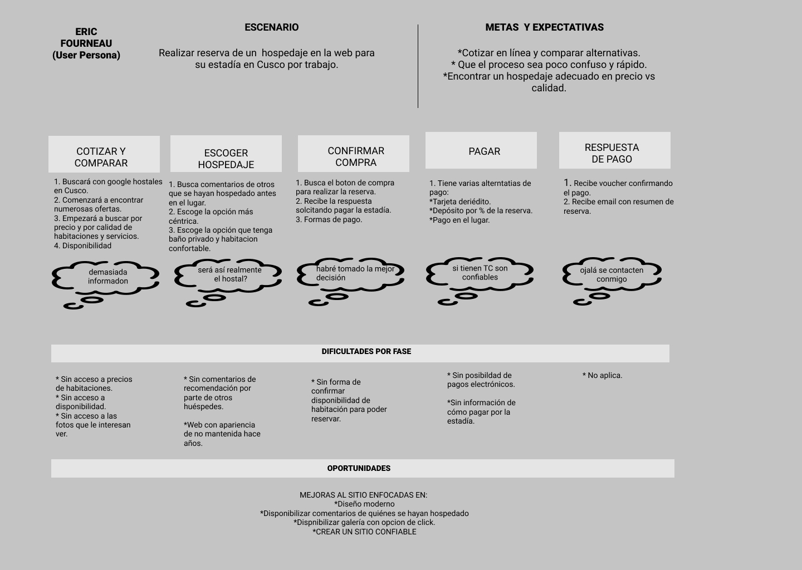

# El Renacimiento

## Objetivos del proyecto

El proyecto consta en una renovación de una página web existente que corresponde al Hostal El Renacimiento ubicado en Cusco, Perú.

## Planeamiento y presupuesto

   

### Trello
https://trello.com/b/eotbA211/hostal-renacimiento

## Problemas identificados en la investigación (del cliente y del usuario)

Gracias a una entrevista realizada con el cliente a través de una videollamada, la cual tuvo una duración aproximada de 40 minutos, pudimos detectar los siguientes problemas:

1) No está recibiendo reservas a través de su sitio de web.
2) Debe depender de terceros para poder obtener reservas exitosas, con lo cual debe pagar una comisión.
3) No cuenta con medios de pago electrónicos lo cual hace que los huéspedes deban pagar por el alojamiento una vez que llegan la lugar. 
4) Fuerte compentencia en el sector que sí dispone de sitios web modernos.
5) No esta pudiendo transmitir la experiencia que quiere vender, dado que ha invertido en moviliario antiguo esperando que sus huéspedes puedan disfrutarlo y valorar su antigüedad.
6) Quiere poder transmitir "Caracter" es decir diferenciarse de su compentencia.
7) Quiere transmitir además que tiene una excelente atención en el lugar.

Gracias a test con usuarios pudimos detectar los siguientes problemas a la hora de reservar a través del sitio:

1) No tienen acceso a ver los precios de las habitaciones.
2) No tienen acceso a seleccionar una imagen y verla, dado que sólo pueden hacerlo a través de una galería en movimiento que no pueden controlar.
3) Al no ver medios de pagos electrónicos para realizar la reserva sienten desconfianza.
4) El sitio al estar desactualizado les genera desconfianza.
5) No reciben una email de confirmación en forma inmedita, sino que varias horas después.

## Definición del público objetivo

### User persona

   

### Customer Journey Map (indicando pain y gain points)

   

## Definición de la solución/producto

Los principales usuarios del producto son personas que frecuentan hostales ya sea por turismo o trabajo que tienen un promedio de edad de entre los 30 y 40 años.
Los objetivos del negocio en relación al producto son: incrementar el número de reservas de habitaciones a través de su sitio de internet, ofrecer una experiencia diferente para los huéspedes así como también destacar la atención del personal del hostal, con la finalidad de crear una preferencia y recomendación del Hostal Renacimiento.
Los objetivos de los usuarios en relación al producto son: poder tener acceso a una web que le permita visualizar rápidamente las características del hostal, sus tarifas, sus servicios y poder así realizar una reserva rápidamente.
La propuesta de valor será transmitir un "Caracter Único" al Hostal proponiendo una experiencia colonial.
Los contenidos que el usuario quiere ver son principalmente precios, habitaciones y servicios disponibles durante la estadía. La información que buscarán para convencerse de comprar y confiar en el hostal serán los comentarios de otros huéspedes que estarán disponibles en la barra de navegación.
Los contenidos más importantes se disponibilizan en la barra de navegación: Precios, Servicios, Galería, Contacto y Comentarios. El flujo es el siguiente:
### Interfaz I
1) Ingresa número de personas necesitan hosperdarse.
2) Ingresa fecha en que llegarán al Hostal a hospedarse (calendario).
3) Clickea "Buscar mi habitación".
### Interfaz II
4) Puede ver inmediatamente caracteristicas de la habitaciónn y servicios.
5) Clickea "Ver fotos". 
6) Clickea "Volver habitación".
### Interfaz III
7) Confirma fecha de ingreso y salida, completando formulario de reserva, clickea "confirmar reserva".
8) Recibe mensaje de "Reserva exitosa y envio de email".
Creemos que el producto resuelve la problemática de la reserva de hospedaje dado que la hace intuitiva y rápida.

## Link a prototipo navegable
https://www.figma.com/file/Z0IzxkPTE9V8i1WhsrlbE22T/Prototipo-Alta-Fidelidad-%7C-Web-Hostal-Renacimiento

## Explicación de cómo los contenidos y funcionalidades responden a los objetivos del proyecto.

Todos los contenidos y funcionalidades se realizaron en base a técnicas de investigación, como entrevista, benchmark, card sorting, testeo de la página web actual y de esa manera logramos detectar cuáles eran las falencias del sitio web, lo que nos llevó a las decisiones de rediseño, considerando un diseño moderno, intuitivo y ágil así como también fuera capaz de proponer una experiencia única conectando a sus huéspedes no sólo con una estructura sino también mobiliario colonial "un viaje a en el timpo".
Los usuarios responden de manera rápida, captamos su atención, entregándoles la información necesaria y pueden reservar sin problemas una habitación.

## Explicación de cómo los contenidos y funcionalidades resuelven cada uno de las necesidades del usuario final.

1) Se entrega de manera inmediata el precio de la habitación seleccionada de manera inmediata y con una fuente clara y tamaño considerable. 
2) Le entregamos una galería funcional, donde el usuario podrá seleccionar la fotografía de manera inmediata y hacer zoom sobre la misma si lo desea.
3) Se aclara que la forma de pago aceptada por el Hostal es sólo en efectivo en el lugar.
4) Se realiza una actualización del sitio, de manera tal que se vea modernidad.
5) Una vez que realiza la reserva el usuario desde el sitio mismo recibe confirmación de rececpción de la reserva y que además recibirá un email de confirmación en su direccion de correo electrónico.

### Link de Zeplin, InVision inspects o Marvel Hand-offs para compartir tus diseños con desarrolladores.
En proceso

### Un video en Loom de máximo 5 minutos explicando tu documento.
https://drive.google.com/file/d/1KimTaJFIOBhjKS62bWCFKaZEM1fVLXvz/view?usp=sharing

### Documentos complementarios del proceso:
https://drive.google.com/open?id=1JhvDIK9IR5jK1sZpfFUyquVhky7UU4qF

### HTML, CSS y JS
https://amdemic.github.io/scl-2018-02-ux-marketplace/

## Ux Designers:

#### Natalie Veloso
#### Andrea De Miranda

