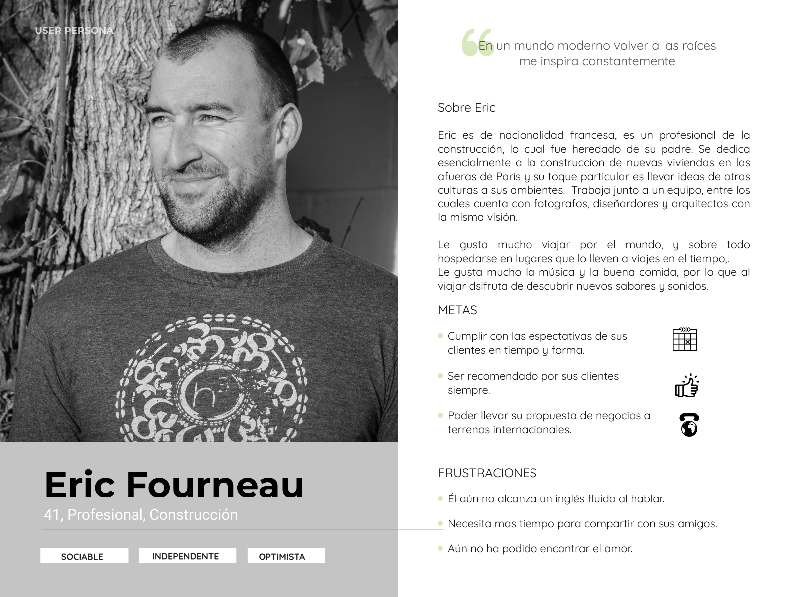

# El Renacimiento

## Objetivos del proyecto

El proyecto consta en una renovación de una página web existente que corresponde al Hostal El Renacimiento ubicado en Cusco, Perú.

## Problemas identificados en la investigación (del cliente y del usuario)

Gracias a una entrevista realizada con el cliente a través de una videollamada, la cual tuvo una duración aproximada de 40 minutos, pudimos detectar los siguientes problemas:

1) No está recibiendo reservas a través de su sitio de web.
2) Debe depender de terceros para poder obtener reservas exitosas, con lo cual debe pagar una comisión.
3) No cuenta con medios de pago electrónicos lo cual hace que los huéspedes deban pagar por el alojamiento una vez que llegan la lugar. 
4) Fuerte compentencia en el sector que sí dispone de sitios web modernos.
5) No esta pudiendo transmitir la experiencia que quiere vender, dado que ha invertido en moviliario antiguo esperando que sus huéspedes puedan disfrutarlo y valorar su antigüedad.
6) Quiere poder transmitir "Caracter" es decir diferenciarse de su compentencia.
7) Quiere transmitir además que tiene una excelente atención en el lugar.

Gracias a test con usuarios pudimos detectar los siguientes problemas a la hora de reservar a través del sitio:

1) No tienen acceso a ver los precios de las habitaciones.
2) No tienen acceso a seleccionar una imagen y verla, dado que sólo pueden hacerlo a través de una galería en movimiento que no pueden controlar.
3) Al no ver medios de pagos electrónicos para realizar la reserva sienten desconfianza.
4) El sitio al estar desactualizado les genera desconfianza.
5) No reciben una email de confirmación en forma inmedita, sino que varias horas después.

## Definición del público objetivo

### User persona

   

### Customer Journey Map (indicando pain y gain points)

## Definición de la solución/producto

Se entrega web intuitiva y funcional de acuerdo a los requerimientos de los usuarios.

## Link a prototipo navegable
figma

## Explicación de cómo los contenidos y funcionalidades responden a los objetivos del proyecto.
Los contenidos fueron testeados con ténicas de Card Sorting y las funcionalidades de acuerdo a las pruebas con usuarios. Los usuarios responden de manera ágil, captamos su atención, entregándoles la información necesaria y pueden reservar sin problemas una habitación.

## Explicación de cómo los contenidos y funcionalidades resuelven cada uno de las necesidades del usuario final.

1) Se entrega de manera inmediata el precio de la habitación seleccionada de manera inmediata y con una fuente clara y tamaño considerable. 
2) Le entregamos una galería funcional, donde el usuario podrá seleccionar la fotografía de manera inmediata y hacer zoom sobre la misma si lo desea.
3) Se aclara que la forma de pago aceptada por el Hostal es sólo en efectivo en el lugar.
4) Se realiza una actualización del sitio, de manera tal que se vea modernidad.
5) Una vez que realiza la reserva el usuario desde el sitio mismo recibe confirmación de rececpción de la reserva y que además recibirá un email de confirmación en su direccion de correo electrónico.

## Link de Zeplin, InVision inspects o Marvel Hand-offs para compartir tus diseños con desarrolladores.
PENDIENTE
### Un video en Loom de máximo 5 minutos explicando tu documento.
PENDIENTE

### Documentos complementarios del proceso:
https://drive.google.com/open?id=1JhvDIK9IR5jK1sZpfFUyquVhky7UU4qF

